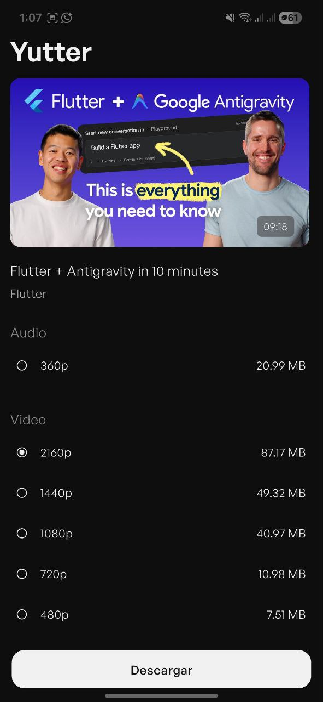
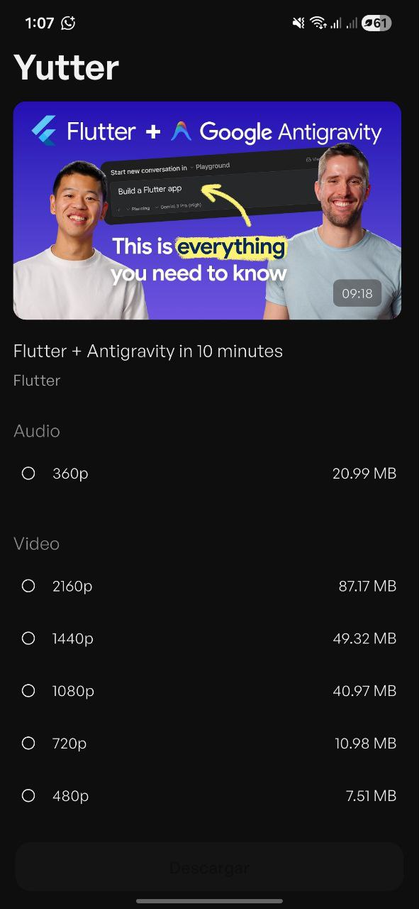

# Yutter 🎵

**Yutter** es una aplicación móvil robusta y minimalista diseñada para la descarga y conversión de audio directamente desde YouTube. Enfocada en ofrecer una experiencia de usuario fluida, permite transformar videos en archivos de música de alta fidelidad listos para tu biblioteca personal.

  

---

## ✨ Características Principal
* **Extracción Directa:** Obtiene flujos de audio de YouTube sin intermediarios pesados.
* **Conversión Profesional:** Procesa archivos para asegurar compatibilidad y calidad sonora.
* **Sincronización Inmediata:** Los archivos aparecen en tu reproductor de música favorito al instante.
* **Interfaz Intuitiva:** Diseñada para ser rápida y fácil de usar.

---

## 🛠️ Tecnologías y Librerías

El núcleo de **Yutter** se construye sobre tres librerías fundamentales del ecosistema Flutter:

### 1. [youtube_explode_dart](https://pub.dev/packages/youtube_explode_dart)
Es el motor de búsqueda y extracción. Permite interactuar con los metadatos de YouTube (títulos, miniaturas, duraciones) y obtener los enlaces directos a los streams de audio sin necesidad de usar la API oficial, lo que garantiza velocidad y privacidad.

### 2. [ffmpeg_kit_flutter_new](https://pub.dev/packages/ffmpeg_kit_flutter_new)
El "estudio de post-producción". Esta librería nos permite realizar el procesamiento pesado de los archivos descargados:
* **Conversión de formatos:** Transcodifica flujos `.webm` o `.m4a` a formatos estándar como `.mp3`.
* **Optimización:** Ajusta el bitrate y la frecuencia de muestreo para un equilibrio perfecto entre peso y calidad.

### 3. [media_scanner](https://pub.dev/packages/media_scanner)
El puente con el sistema operativo. Una vez que el archivo se guarda en el almacenamiento, esta herramienta notifica al sistema para que indexe la nueva canción. Gracias a esto, la música aparece en tu biblioteca de Android o iOS sin necesidad de reiniciar el dispositivo.

---

  

